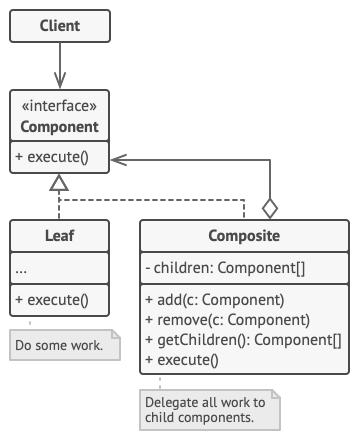
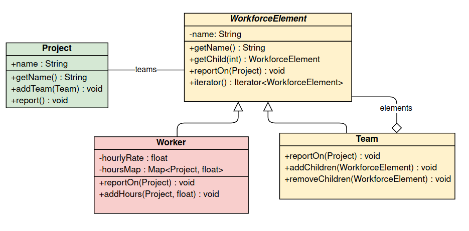
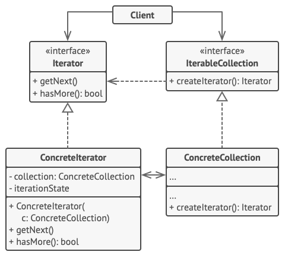
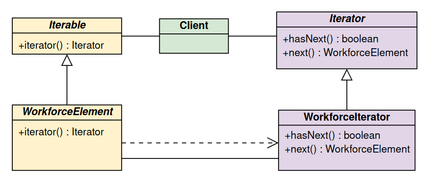
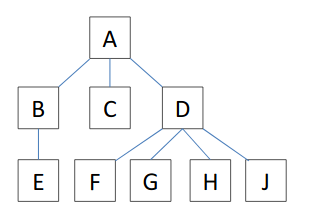
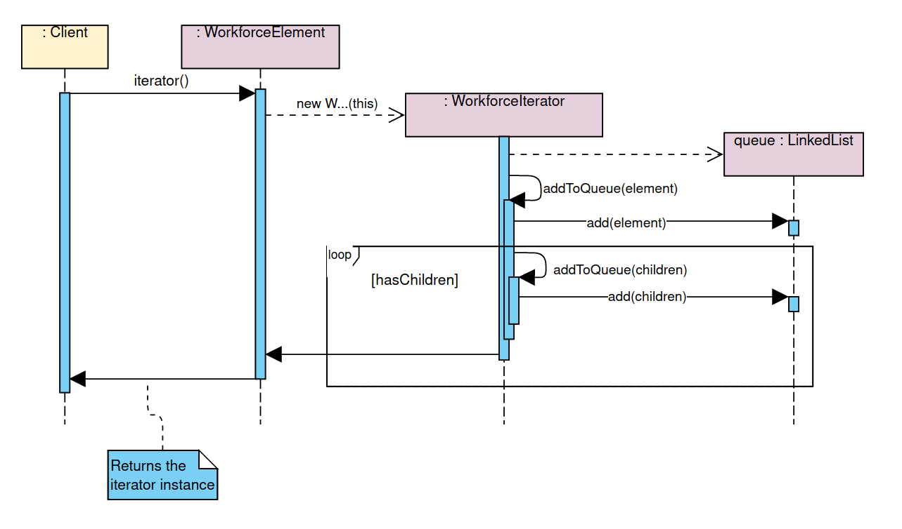

# Ejercicio 2: Gestión de equipos de trabajo

## Patrones de diseño

### Patrón Composición
El patrón de diseño escogido para el ejercicio es Composición. El motivo por el cual no cabe duda es que la estructura
que se pretende representar es similar a la de un árbol. En la que los nodos son equipos y trabajadores, más
concretamente siendo los equipos los nodos y los trabajadores las hojas.

#### Modelo Composición



#### Diseño implementado al problema



#### Explicaciones

- El cliente es el proyecto, ya que es el que utiliza a los elementos del personal de la empresa, representados por
  instancias de *WorkforceElement* en forma de árbol.

- Para representar a la plantilla de la empresa se utiliza la clase abstracta *WorkforceElement*, que conforma cada uno
  de los nodos del árbol. Los cuales pueden ser de dos tipos:
    - Contenedores (Team): Contienen más elementos de la plantilla y delega la operación principal.
    - Hojas (Worker): Contienen la información necesaria para la operación principal *report()* del cliente.
        - hourlyRate: Contiene el salario/hora del trabajador.
        - hoursMap: Mapa clave-valor que contiene las horas (valor) trabajadas en cada proyecto (clave) por el
          trabajador.

- La operación común es *reportOn(Project)* que lo que hace es recorrer todos los elementos del árbol empezando por él
  elemento desde el que se llama, y realizar un informe/sumatorio de la totalidad del coste del proyecto. Para realizar
  esta operación se utilizan más métodos no reflejados en el diagrama anterior, omitidos para facilitar la comprensión,
  ya que estos son exclusivamente llamados desde el método *report* y sirven para hacer los cálculos. Estos métodos
  funcionan de la misma forma que *report*, en las hojas realizan cálculos y los contenedores delegan siempre el trabajo
  a todos sus hijos.
    - *getHours(Project)*: Devuelve el total de horas invertidas por un trabajador en un proyecto dado, o en su defecto,
      si se llamase desde un equipo, la suma todas las horas invertidas por los miembros del mismo.
    - *getCost(Project)*: Idem, multiplicado por el salario/hora de los trabajadores.

- **Anotación**: En el diagrama, aparece representado el cliente (Project) relacionado con WorkforceElement. En la
  práctica y por seguir el enunciado, esta relación es realmente con la clase Team ("Un proyecto se organiza en una
  jerarquía de equipos de trabajo."). Esto se realiza para asegurar que no hay trabajadores sueltos en los proyectos.
  Aun así, si así se desease, se podría cambiar la firma de la lista por `List<WorkforceElement>` en todas sus
  apariciones y se solventaría sin ninguna otra modificación.

### Patrón Iterador

El patrón iterador nos sirve en el software para recorrer la estructura del árbol de forma secuencial y sin tener en
cuenta el árbol. Está implementado de forma que recorre el árbol desde el elemento desde el que se llama y de forma
descendente, utilizando el algoritmo *preorder*.

#### Modelo Iterador



#### Implementación concreta



En este caso, al estar utilizando Java, solo tenemos que realizar codificar la clase ConcreteIterator, e implementar la
interfaz Iterable en la colección (en nuestro caso el árbol empezado en WorkforceElement).

#### Algoritmo de recorrido *preorder*

El algoritmo utilizado para recorrer el árbol es *preorder*. Devuelve primero el elemento padre, de cada hijo siempre
recorrido todos sus hijos antes de pasar a su hermano. Más sencillo con ejemplos:



- Preorder desde A: ABECDFGHJ
- Preorder desde D: DFGHJ
- Preorder desde C: C

## Principios de diseño

### YAGNI (You aren't gonna' need it)

Como ejemplo del uso, revisando el código, hemos encontrado una función no utilizada y además que permitía modificar el
arraylist de teams de manera peligrosa sin ninguna comprobación previa, con lo cual, **como no lo íbamos a necesitar**
hemos decidido borrarla. El borrado está en el
commit [3153194](https://github.com/jorgeteixe/DS-43-08/commit/315319455f088a841032ffd527628a1f9dfd91f6?branch=315319455f088a841032ffd527628a1f9dfd91f6&diff=unified)
.

### DRY (Don't repeat yourself)

Para no repetir varias veces el mismo trozo de código que comprueba la pertenencia de un elemento de la plantilla a un
proyecto, después de tenerlo repartido se refactorizó en un único método dentro de la clase Project que, dado un
*WorkforceElement* devuelve `true` si puede trabajar en ese proyecto y `false` en caso contrario.

```java
/**
 * Checks if the given element is an allowed element
 * in the project.
 *
 * @param we the element to check
 * @return <code>true</code> if is allowed, or
 * <code>false</code> otherwise
 */
public boolean hasWorkforceElement(WorkforceElement we){
    ...
}
```

### KISS (Keep it simple, stupid)

Este principio fue básico para pensar el código del iterador creado. Después de varias vueltas intentando codificarlo,
de manera no satisfactoria, se realizó un cambio en el planteamiento que finalmente consiguió mantener el código simple.
Estábamos intentando hacer que el iterador, cada vez que se llamaba a su método `next()` realizara el cálculo de cuál
sería el siguiente elemento del árbol. De esta manera teníamos que añadir varios atributos, llevar la cuenta de en qué
elemento íbamos, y programar un complejo algoritmo. Al final, y de forma mucho más sencilla, al llamar al constructor
del iterador se crea una cola con todos los elementos por los que se va a iterar, y con una simple llamada se consigue
el siguiente. Véase:

Creación de la cola:

```java
/**
 * Adds the given element to the queue, determines with
 * element has to be next and calls recursively with the
 * element.
 *
 * @param we the element to be added to the queue
 */
private void addToQueue(WorkforceElement we){
    queue.add(we);
    int i=0;
    while(we.getChild(i)!=null){
        addToQueue(we.getChild(i++));
    }
}
```

Llamada a `next()` simplificada:

```java
@Override
public WorkforceElement next() { return queue.pop(); }
```

Diagrama creación iterador:


### SOLID

#### Single Responsibility

Las clases cumplen una única responsabilidad. 
- Worker: almacenar el coste del trabajo de un trabajador en un proyecto.
- Team: agrupar elementos.
- Project: almacenar el coste derivado de un proyecto.

#### Open/Close principle

Si quisiéramos cambiar el código para calcular el precio hora, y añadir 10 € de comisión por cada trabajador en un 
proyecto, el código estaría abierto a modificaciones pero cerrado para poder usarlo. Véase:

Código inicial:
```java
@Override
public float getCost(Project project) {
    return getHours(project) * hourlyRate;
}
```

Código modificado:
```java
@Override
public float getCost(Project project) {
    return getHours(project) * hourlyRate + 10f;
}
```

Y no tendríamos que realizar ninguna otra modificación en ninguna de las clases que lo utilizan, tan sol cambia el
comportamiento del Worker.

#### Liskov substitution principle

La clase WorkforceElement cumple este principio con los elementos Team y Worker. Se pueden intercambiar sin suponer un
cambio en la conducta del software.

#### Dependency inversion principle

Se cumple al utilizar la clase `List` o `Iterator`. Siempre utilizando la clase abstracta. También se procura utilizar
siempre con los WorkforceElement. A excepción de que Project se relaciona con Team por seguridad y fidelidad al
enunciado.